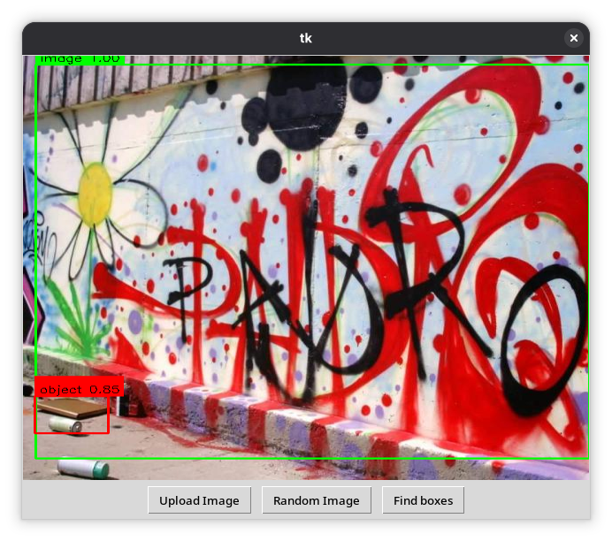

# Декетор объектов и изображений на плоских поверхностях



Проект для МТУСИ, реализующий детекцию и классификацию объектов на плоских поверхностях с помощью машинного обучения. Проект реализован на основе модели Faster R-CNN. Обучение происходило с использованим собственного датасета, хранящегося на [Roboflow](https://app.roboflow.com/mtuci-sasla/objects-on-surfaces/7). 

## Установка

Работоспособность проверена только на Python 3.13

Установка зависимостей:

```
pip install -r -requirement.txt
``` 

Для работы кнопки **Random Image** требуются изображения в пути ```./data/test/images/```. 

## Обучение

Обучение выполняется через [Notebook](./docs/Training.ipynb). Из Roboflow загружается датасет и через Pytorch загружается предобученная модель Faster R-CNN. После обучения веса сохраняются в виде файла trained.pt.

Помимо этого в файле есть возможность посмотреть метрики, полученные при обучении и тестировании.

## Запуск модели

Для демонстрации работы модели создано приложение на основе tkinter. Запуск производится через файл ```main.py```. При запуске будет загружена предобученная модель, а также веса из пути ```./detector/trained.pt```. В репозитории уже хранятся готовые веса.

В программе содержатся следующие кнопки для управления:
- **Upload Image** - загружает в приложение изображение, выбранное через дилоговое окно;
- **Random Image** - выбирает случайное изображение из пути ```./dat/test/images/```;
- **Find boxes** - запускает модель, и выводит изображение с найденными объектами, их классами и уверенностью модели.

